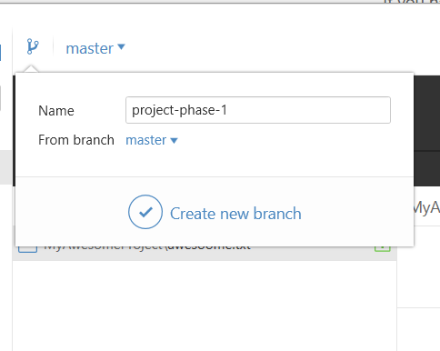

# Preface

Please note that if you have set up ssh key, you will not be asked username + password everytime you connect to github (how? [Step 1] (https://help.github.com/articles/generating-a-new-ssh-key-and-adding-it-to-the-ssh-agent/) [Step 2](https://help.github.com/articles/adding-a-new-ssh-key-to-your-github-account/))

After adding SSH key, make sure you are using ssh protocol (`git@github.com:SeiryuZ/BIWirelessMobile.git`) when cloning instead of https protocol (`https://github.com/SeiryuZ/BIWirelessMobile.git`)


# Shortcuts

1. [OSX / Linux] (https://github.com/SeiryuZ/BIWirelessMobile/blob/master/git-cheatsheet.md#for-osx--linux)
2. [Windows] (https://github.com/SeiryuZ/BIWirelessMobile/blob/master/git-cheatsheet.md#for-windows)


## For OSX / Linux

####1. Make sure you have cloned the repository

  ```
git clone [GITHUB address] [destination dir]

# for example
git clone git@github.com:SeiryuZ/BIWirelessMobile.git ~/dev/wireless-mobile

# Or use https protocol, you will be asked username and password
# When not specifying target dir, it will be cloned into the current folder
git clone https@github.com:SeiryuZ/BIWirelessMobile.git 
```

####2. Copy your whole Android project to the working directory
  ```
# Or you can just drag and drop to the folder
cp ~/Desktop/my-awesome-final-project ~/dev/wireless-mobile/
```


####3. Change working directory to the folder
  ```
  cd ~/dev/wireless-mobile/
  ```


####4. Make a new branch (Do not commit to master branch directly)
  ```
  git checkout -b [branch name]
  
  # For our class please stick to this naming
  git checkout -b project-phase-1
  ```

####5. Add your files to the staging phase (Files are not committed yet)
  ```
  # You can add files one by one
  git add [files]
  
  # or you can add everything on the current working directory to git
  git add .
  ```
  
  
####6. Validate that files on the staging area are correct, and want to be committed

  ```
  git status
  ```
  
###### <sub><sub>Bless you beautiful people who use OSX / Linux</sub></sub>


####7. Commit the files on the staging are

   ```
   # This will start the editor of your choice, you can set it to vim / nano / atom / anything else 
   # See https://help.github.com/articles/associating-text-editors-with-git/
   git commit
   
   # Or you want to add commit message directly
   git commit -m "This is my awesome commit. Bug GO AWAY"
   ```
  


####8. Push the commit to github 
  ```
  git push
  
  # If this is the first time you push this branch to github, there will be an error. Just follow the instruction on the error
  # usually like this
  git push --set-upstream origin project-phase-1
  ```
  
  
####9. Make a pull request on github
  
  ---
  

  

####10. You updated your project and want to update the pull request? Go to step 5


------------------

## For Windows

### I prefer typing on command lines
Install this git for windows [here] (https://git-for-windows.github.io/) and follow the OSX / Linux steps [here]  (https://github.com/SeiryuZ/BIWirelessMobile/blob/master/git-cheatsheet.md#for-osx--linux) <sup><sup><sup><sup><sup>You beautiful creature</sup></sup></sup></sup></sup>

---

### I prefer clicking on things

####1. Install github for desktop [here] (https://desktop.github.com/)

####2. Clone 
  


####3. Add your project to the folder you cloned into

####4. Make new branch [Do not commit directly on master branch]
  

####5. Commit files
  

####6. Click publish
  

####7. New update?  Repeat step 5 ~ 6 and click sync
