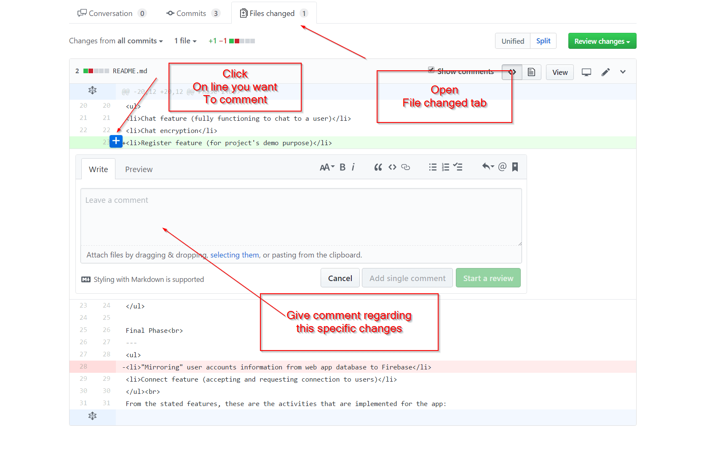

# Peer review guide

## Preface

  * Class participation mark is individual
  * Weight is 20% of total mark
  * Duration: week 8 ~ week 12

------

## 1. Make sure you are on their correct branch, then you can browse their code on the repository's homepage
  
  
  
  
 -----

## 2. You can make an issue
  
  
 -----

## 3. Or you review their pull request (Changes that they want to introduce in phase 2), and comment there

  

 -----
  ### Overall comment
  

  -----
  ### OR Change-specific comment
  
